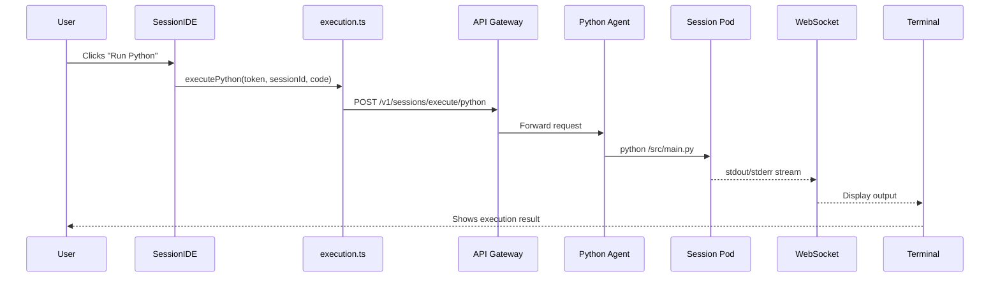
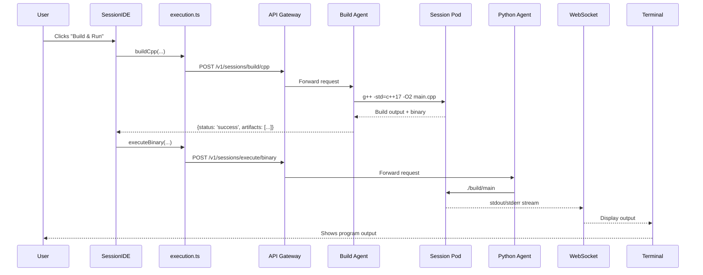

# Code Execution System Implementation

## Overview

This document describes the complete code execution system for CoSim, enabling users to write Python and C++ code in the Monaco editor and run it with real-time output streaming to an integrated terminal.

## Architecture

```
┌─────────────────────────────────────────────────────────────┐
│                    Frontend (Browser)                       │
│  ┌──────────────┐  ┌──────────────┐  ┌─────────────────┐  │
│  │ Monaco Editor│  │ SessionIDE   │  │ Terminal (xterm)│  │
│  │  (Code Edit) │─▶│ (Execution)  │─▶│  (Output View)  │  │
│  └──────────────┘  └──────────────┘  └─────────────────┘  │
│         │                  │                   │            │
│         │                  │                   │            │
│         └──────────────────┴───────────────────┘            │
│                            │                                │
│                  ┌─────────▼──────────┐                    │
│                  │  Execution API      │                    │
│                  │  (execution.ts)     │                    │
│                  └─────────┬───────────┘                    │
└─────────────────────────────┼──────────────────────────────┘
                              │
                   ┌──────────▼──────────┐
                   │  API Gateway (8080) │
                   └──────────┬──────────┘
                              │
        ┌─────────────────────┼─────────────────────┐
        │                     │                     │
┌───────▼────────┐  ┌────────▼────────┐  ┌────────▼────────┐
│ Python Agent   │  │  Build Agent    │  │ WebSocket Term  │
│ (Execution)    │  │  (C++ Compile)  │  │  (PTY/Shell)    │
└───────┬────────┘  └────────┬────────┘  └────────┬────────┘
        │                     │                     │
        └─────────────────────┴─────────────────────┘
                              │
                    ┌─────────▼─────────┐
                    │  Session Pod      │
                    │  (User Workspace) │
                    └───────────────────┘
```

## Components

### 1. Frontend Components

#### `/frontend/src/api/execution.ts`
**Complete API layer for code execution and file management**

**Functions:**
- `executePython(token, sessionId, code, filePath, args?)` - Execute Python scripts
- `buildCpp(sessionId, sourceFiles, outputBinary, compiler, flags)` - Compile C++ code
- `executeBinary(sessionId, binaryPath, args?)` - Run compiled binaries
- `saveFile(token, sessionId, path, content)` - Save file to workspace
- `readFile(token, sessionId, path)` - Read file from workspace
- `listFiles(token, sessionId, directory)` - List directory contents
- `createTerminalWebSocket(token, sessionId)` - Create WebSocket connection
- `getExecutionStatus(token, executionId)` - Poll execution status

**TypeScript Interfaces:**
```typescript
interface CodeExecutionRequest {
  session_id: string;
  language: 'python' | 'cpp';
  code: string;
  file_path?: string;
  args?: string[];
}

interface BuildRequest {
  session_id: string;
  source_files: string[];
  output_binary: string;
  compiler: 'g++' | 'clang++';
  flags?: string[];
}

interface FileOperation {
  session_id: string;
  path: string;
  content?: string;
}
```

#### `/frontend/src/components/Terminal.tsx`
**Interactive terminal with WebSocket connection**

**Features:**
- ✅ Real-time WebSocket communication with backend
- ✅ Command history (up/down arrow navigation)
- ✅ Ctrl+C interrupt support
- ✅ ANSI color codes for styled output
- ✅ Connection status indicators (CONNECTED/CONNECTING)
- ✅ Automatic reconnection on disconnect
- ✅ Terminal resize events sent to backend
- ✅ Enhanced welcome message with ASCII art
- ✅ Fallback simulation mode for development

**WebSocket Message Types:**
```typescript
// Client → Server
{ type: 'command', command: string }
{ type: 'interrupt' }
{ type: 'resize', rows: number, cols: number }

// Server → Client
{ type: 'output', content: string }
{ type: 'error', message: string }
{ type: 'prompt' }
{ type: 'exit', code: number }
```

**Connection:**
- URL: `ws://localhost:8080/v1/sessions/{sessionId}/terminal?token={jwt}`
- Authentication: JWT token in query string
- Reconnection: Automatic retry with exponential backoff

#### `/frontend/src/components/SessionIDE.tsx`
**Main IDE container with integrated execution**

**New Features:**
- ✅ "Run Python" button for `.py` files
- ✅ "Build" button for `.cpp` files
- ✅ "Run Binary" button (appears after successful build)
- ✅ "Build & Run" button for one-click compilation + execution
- ✅ Execution state indicators (loading spinners)
- ✅ Auto-save before execution
- ✅ Token-based authentication integration
- ✅ Error handling with console output

**Button Visual Design:**
```
Python:
  🐍 Run Python     - Green gradient (#0dbc79 → #23d18b)

C++:
  🔨 Build          - Yellow gradient (#e5e510 → #f5f543)
  ▶️  Run Binary    - Blue gradient (#2472c8 → #3b8eea)
  ⚡ Build & Run    - Purple gradient (#bc3fbc → #d670d6)
```

**User Workflow:**
1. User writes Python code in Monaco editor
2. Clicks "▶️ Run Python"
3. Code is saved to workspace
4. `executePython()` sends code to backend
5. Output streams to Terminal via WebSocket
6. Success/error shown in terminal

### 2. Backend Components (To Be Implemented)

#### API Endpoints

**Python Execution:**
```http
POST /v1/sessions/execute/python
Content-Type: application/json
Authorization: Bearer <jwt>

{
  "session_id": "session-1",
  "language": "python",
  "code": "print('Hello, CoSim')",
  "file_path": "/src/main.py",
  "args": []
}

Response:
{
  "execution_id": "exec-abc123",
  "status": "running",
  "pid": 12345
}
```

**C++ Build:**
```http
POST /v1/sessions/build/cpp
Content-Type: application/json
Authorization: Bearer <jwt>

{
  "session_id": "session-1",
  "source_files": ["/src/main.cpp"],
  "output_binary": "/workspace/build/main",
  "compiler": "g++",
  "flags": ["-std=c++17", "-O2", "-Wall"]
}

Response:
{
  "build_id": "build-xyz789",
  "status": "success",
  "stdout": "Compiled successfully",
  "stderr": "",
  "artifacts": ["/workspace/build/main"]
}
```

**Binary Execution:**
```http
POST /v1/sessions/execute/binary
Content-Type: application/json
Authorization: Bearer <jwt>

{
  "session_id": "session-1",
  "binary_path": "/workspace/build/main",
  "args": ["--verbose"]
}

Response:
{
  "execution_id": "exec-def456",
  "status": "running",
  "pid": 12346
}
```

**File Operations:**
```http
POST /v1/sessions/files/write
{
  "session_id": "session-1",
  "path": "/src/main.py",
  "content": "print('Hello')"
}

POST /v1/sessions/files/read
{
  "session_id": "session-1",
  "path": "/src/main.py"
}

POST /v1/sessions/files/list
{
  "session_id": "session-1",
  "directory": "/src"
}
```

**WebSocket Terminal:**
```
WS /v1/sessions/{sessionId}/terminal?token={jwt}
```

**Server-side Requirements:**
1. Create PTY (pseudo-terminal) in session pod
2. Forward stdin from WebSocket to PTY
3. Stream stdout/stderr from PTY to WebSocket
4. Handle SIGINT on interrupt messages
5. Update PTY dimensions on resize events
6. Clean up resources on disconnect

## Execution Flow

### Python Execution



### C++ Build & Run



## Configuration

### Environment Variables

**Frontend `.env`:**
```env
VITE_API_BASE_URL=/api
VITE_COLLAB_WS_URL=ws://localhost:1234
VITE_WEBRTC_SIGNALING_URL=ws://localhost:3000
VITE_DEBUG=false
```

**Backend Environment:**
```env
# Session Pod Configuration
SESSION_PYTHON_VERSION=3.11
SESSION_CPP_COMPILER=g++-12
SESSION_WORKSPACE_PATH=/workspace
SESSION_BUILD_PATH=/workspace/build
SESSION_MAX_MEMORY=2Gi
SESSION_MAX_CPU=2

# Execution Limits
PYTHON_MAX_RUNTIME=300s
CPP_BUILD_TIMEOUT=120s
BINARY_MAX_RUNTIME=300s

# WebSocket Terminal
TERMINAL_IDLE_TIMEOUT=1800s
TERMINAL_MAX_BUFFER=1MB
```

### Vite Proxy Configuration

**`frontend/vite.config.ts`:**
```typescript
export default defineConfig({
  server: {
    proxy: {
      '/api': {
        target: 'http://localhost:8080',
        changeOrigin: true,
        rewrite: (path) => path.replace(/^\/api/, '/v1')
      }
    }
  }
});
```

## Security

### Authentication
- All API requests require JWT token in `Authorization: Bearer <token>` header
- WebSocket connections authenticate via query string token
- Tokens stored in `localStorage` on frontend
- Session IDs validated against authenticated user

### Isolation
- Each session runs in dedicated Kubernetes pod
- Workspace files isolated per session
- No cross-session file access
- Network policies restrict pod-to-pod communication

### Resource Limits
- CPU/Memory quotas per session
- Execution timeouts prevent runaway processes
- Disk space quotas enforced
- Rate limiting on API endpoints

### Code Safety
- Sandboxed execution environment
- No access to host filesystem
- No privileged operations
- Process monitoring for crypto-mining detection

## Testing

### Frontend Testing

**Test Terminal Component:**
```bash
# Run frontend dev server
cd frontend
npm run dev

# Open browser to http://localhost:5173
# Navigate to workspace with session
# Terminal should show "CONNECTING..." then "CONNECTED"
# Type commands and see simulated responses
```

**Test SessionIDE Execution:**
```bash
# 1. Open SessionIDE in browser
# 2. Write Python code in Monaco editor
# 3. Click "Run Python" button
# 4. Check browser console for execution API call
# 5. Verify Terminal receives output
```

### Backend Testing

**Test Python Execution Endpoint:**
```bash
curl -X POST http://localhost:8080/v1/sessions/execute/python \
  -H "Authorization: Bearer <token>" \
  -H "Content-Type: application/json" \
  -d '{
    "session_id": "session-1",
    "language": "python",
    "code": "print(\"Hello, CoSim\")",
    "file_path": "/src/test.py"
  }'
```

**Test C++ Build Endpoint:**
```bash
curl -X POST http://localhost:8080/v1/sessions/build/cpp \
  -H "Authorization: Bearer <token>" \
  -H "Content-Type: application/json" \
  -d '{
    "session_id": "session-1",
    "source_files": ["/src/main.cpp"],
    "output_binary": "/workspace/build/main",
    "compiler": "g++",
    "flags": ["-std=c++17", "-O2"]
  }'
```

**Test WebSocket Terminal:**
```bash
# Use wscat to test WebSocket connection
npm install -g wscat
wscat -c "ws://localhost:8080/v1/sessions/session-1/terminal?token=<jwt>"

# Send command
> {"type": "command", "command": "ls -la"}

# Should receive output messages
< {"type": "output", "content": "total 16\ndrwxr-xr-x ..."}
```

## Development Workflow

### Adding New Language Support

To add support for a new language (e.g., Rust):

1. **Add language to execution API:**
   ```typescript
   export const executeRust = async (
     token: string,
     sessionId: string,
     code: string,
     filePath?: string
   ) => {
     return authorizedClient(token).post('/api/v1/sessions/execute/rust', {
       session_id: sessionId,
       language: 'rust',
       code,
       file_path: filePath
     });
   };
   ```

2. **Add button to SessionIDE:**
   ```tsx
   {selectedFile.endsWith('.rs') && (
     <button onClick={handleRunRust}>
       🦀 Run Rust
     </button>
   )}
   ```

3. **Implement backend agent:**
   - Create Rust Agent in backend
   - Add endpoint `/v1/sessions/execute/rust`
   - Install Rust toolchain in session pod images
   - Stream output to WebSocket terminal

### Debugging Execution Issues

**Frontend debugging:**
```javascript
// In SessionIDE.tsx
console.log('Executing:', { sessionId, selectedFile, codeLength: currentContent.length });
```

**Backend debugging:**
```python
# In Python Agent
logger.info(f"Executing Python code for session {session_id}")
logger.debug(f"Code: {code[:100]}...")
```

**Terminal debugging:**
```javascript
// In Terminal.tsx
ws.onmessage = (event) => {
  console.log('[Terminal] Received:', event.data);
  // ... handle message
};
```

## Performance Considerations

### Optimization Strategies

1. **Code Caching:**
   - Cache compiled C++ binaries by source hash
   - Reuse binary if source hasn't changed
   - Save ~5-10 seconds per C++ execution

2. **Parallel Compilation:**
   - Use `make -j$(nproc)` for multi-file projects
   - Compile dependencies concurrently
   - Reduces build time for large C++ projects

3. **WebSocket Connection Pooling:**
   - Reuse WebSocket connection across multiple executions
   - Avoid reconnection overhead
   - Reduces latency by ~100-200ms

4. **Terminal Output Buffering:**
   - Buffer small outputs (< 100 chars)
   - Send in batches to reduce WebSocket messages
   - Improves performance for high-frequency output

## Known Limitations

1. **Terminal lacks full shell features:**
   - No job control (bg/fg)
   - No environment variable persistence
   - No command piping (|)
   - Workaround: Use Python subprocess for complex commands

2. **C++ build errors not shown inline:**
   - Build errors appear in terminal only
   - No Monaco editor error markers
   - TODO: Parse compiler output and show inline diagnostics

3. **No debugger integration:**
   - Cannot set breakpoints
   - No step-through debugging
   - TODO: Integrate debugpy (Python) and gdb (C++)

4. **No autocomplete in terminal:**
   - Tab key has placeholder handler
   - No file/command completion
   - TODO: Implement server-side autocomplete

## Future Enhancements

### Phase 1 (Immediate)
- [ ] Implement backend WebSocket terminal endpoint
- [ ] Add Python/C++ execution agents
- [ ] File save/load persistence
- [ ] Error handling UI (toast notifications)

### Phase 2 (Short-term)
- [ ] Inline build error markers in Monaco
- [ ] Compiler flags UI (optimization, debug symbols)
- [ ] Python virtual environment management
- [ ] C++ CMake support for multi-file projects

### Phase 3 (Medium-term)
- [ ] Debugger integration (breakpoints, step-through)
- [ ] Terminal autocomplete
- [ ] Code profiling (execution time, memory usage)
- [ ] TensorBoard integration for ML training

### Phase 4 (Long-term)
- [ ] GPU execution support for CUDA/OpenCL
- [ ] Multi-language notebooks (mix Python/C++/Bash)
- [ ] Real-time collaboration on execution (shared terminal)
- [ ] Checkpoint/restore for long-running simulations

## References

### Documentation
- [Monaco Editor API](https://microsoft.github.io/monaco-editor/docs.html)
- [xterm.js Documentation](https://xtermjs.org/)
- [Yjs CRDT](https://docs.yjs.dev/)
- [WebSocket API](https://developer.mozilla.org/en-US/docs/Web/API/WebSocket)

### Related Files
- `frontend/src/api/execution.ts` - Execution API
- `frontend/src/components/Terminal.tsx` - Terminal component
- `frontend/src/components/SessionIDE.tsx` - IDE integration
- `frontend/vite.config.ts` - Proxy configuration
- `frontend/.env` - Environment variables
- `AGENT.md` - System architecture spec
- `API_FIXES_SUMMARY.md` - API routing fixes

### Backend Implementation Guide
See `AGENT.md` sections:
- Section 9: "Agent Roster" - Describes all backend agents
- Section 6: "Session & Job Flows" - Execution flow diagrams
- Section 7: "Runtime & Infrastructure" - Kubernetes setup

## Support

For issues or questions:
1. Check browser console for frontend errors
2. Check backend logs for API/agent errors
3. Verify WebSocket connection in Network tab
4. Test endpoints with curl/Postman
5. Review this document for configuration examples

---

**Status:** ✅ Frontend Implementation Complete | ⏳ Backend Implementation Pending

**Last Updated:** 2024 (Initial Implementation)
